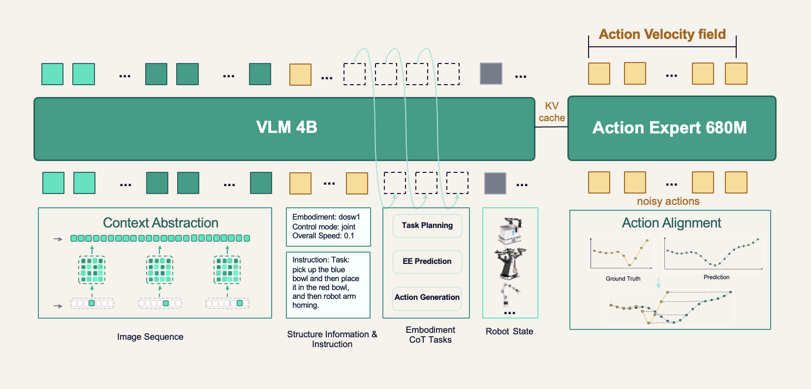

# DM05 Tutorial

DM0.5 is Dexmal's open-world VLA: a 4B VLM plus a 680M Action Expert that emits continuous actions with Flow Matching. It is larger than DM0, and history, embodied reasoning, action supervision, and data quality are stronger, so the model can track task progress, follow open instructions, and stay stable under camera change and human interference.

Main gains (pretrained):

- Zero-shot: follow language in unseen open scenes (8 primitives, 7 condition types).
- Fine-tune: a stronger base gives cheaper, better specialists.
- Long memory: history up to 60 seconds.
- Robust actions: lighting, camera motion, human perturbation.
- Multi-embodiment: multi-robot pretrain, then transfer.

This repo implements **Gemma3 VLM + Gemma3 Action Expert**.



More narrative and official eval videos: [DM0.5 blog](https://www.dexmal.com/blog/dm0.5).

## Pretrained Model

Download the Hugging Face base weights to `checkpoints/DM05`. Playground training defaults resolve to that path.

| Model | Description | Input Images | Action Dim | Backbone | Link |
| - | - | - | - | - | - |
| DM05 | Base Gemma3 VLM + Flow Matching Action Expert | set by the playground (LIBERO: `agentview` + `wrist`) | padded to 32D (LIBERO valid dim 7) | 4B VLM | [🤗 Hugging Face](https://huggingface.co/Dexmal/DM05) |

```bash
huggingface-cli download Dexmal/DM05 \
  --local-dir checkpoints/DM05 \
  --local-dir-use-symlinks False
```

Entrypoints default to `./checkpoints/DM05` for training. The official LIBERO eval checkpoint is [Dexmal/DM05-libero](https://huggingface.co/Dexmal/DM05-libero); see [Benchmark Results](#benchmark-results).

## Installation and Environment Setup

The DM05 image is `dexmal/dexbotic:dm05`. Clone the repo on the host, mount it into the container, then install the mounted source.

```bash
git clone https://github.com/Dexmal/dexbotic.git

docker run -it --rm --gpus all --network host \
  -v /path/to/dexbotic:/dexbotic \
  dexmal/dexbotic:dm05 \
  bash

cd /dexbotic
conda activate dexbotic
pip install -e .
```

Local conda install if you are not using Docker:

```bash
git clone https://github.com/Dexmal/dexbotic.git
conda create -n dexbotic python=3.10 -y
conda activate dexbotic

pip install torch torchvision \
  --index-url https://download.pytorch.org/whl/cu128

pip install ninja packaging
MAX_JOBS=2 pip install flash-attn --no-build-isolation

cd dexbotic
pip install -e .
pip install transformers==5.3.0
```

The default train recipes below need 8 GPUs (H20 / A100 / H100 for full SFT; 4090 works for LoRA). One GPU is enough for inference. FSDP2 notes: [FSDP2.md](FSDP2.md).

## LIBERO Data

LIBERO is the shipped example. The in-repo recipes train on `libero_pi0_all` from [Dexmal/libero](https://huggingface.co/datasets/Dexmal/libero). After download, that split should sit under `data/libero`. Full SFT vs LoRA differences are in the [Training](#training) table.

```bash
huggingface-cli download Dexmal/libero \
  --repo-type dataset \
  --local-dir data/.hf_downloads/libero \
  --local-dir-use-symlinks False

mkdir -p data/libero
cp -a data/.hf_downloads/libero/libero_pi0_all data/libero/
test -d data/libero/libero_pi0_all/jsonl
test -d data/libero/libero_pi0_all/image
```

If the download is archives instead of a folder, extract into `data/libero` so those two paths exist. Dataset catalog: [Data.md](Data.md#using-provided-data).

## Training

Start from `./checkpoints/DM05` and `data/libero/libero_pi0_all` above. Full SFT and LoRA are two playground files.

### Training a Model with Provided Data

| Item | Full SFT | LoRA |
| --- | --- | --- |
| Entrypoint | [`libero_dm05.py`](../playground/benchmarks/libero/libero_dm05.py) | [`libero_dm05_lora.py`](../playground/benchmarks/libero/libero_dm05_lora.py) |
| `use_lora` | `False` | `True` |
| Backend | FSDP2 | DDP only (`deepspeed=None`) |
| GPUs | 8 × H20 / A100 / H100 | 8 × 4090 or H20; on multi-GPU 4090 set `NCCL_P2P_DISABLE=1 NCCL_IB_DISABLE=1` |
| Extra install | — | `pip install "peft>=0.13.0"` |
| LLM attention | `flex_attention` | `eager` |
| Vision / action attention | `flash_attention_2` / `sdpa` | `sdpa` / `sdpa` |
| VLM / AE gradient checkpointing | off | on |
| LR / warmup | `2.5e-5` / `1000` | `5e-4` / `500` |
| Per-device batch | `8` | `4` |
| `model_max_length` | `768` | `1024` |
| Steps / save | `50000` / `10000` | `50000` / `10000` |
| LoRA | — | `r=32`, `alpha=16`, `dropout=0`, `all-linear` (no `lm_head`) |
| Output | `./user_checkpoints/dexbotic/libero_dm05/libero-sft` | `./user_checkpoints/dexbotic/libero_dm05_lora/libero-lora-MMDD` |
| Infer default path | `./checkpoints/DM05` unless you pass `--model_name_or_path` | `./user_checkpoints/dexbotic/libero_dm05_lora/libero-lora-MMDD` |

Shared: `model_name_or_path=./checkpoints/DM05`, `dataset_name=libero_pi0_all`, 2 views, `chunk_size=10`, `diffusion_steps=10`, pad-to-square then `448×448`, `bf16`, `save_hf_sidecar=True`.

```bash
# full SFT
torchrun --nproc_per_node=8 playground/benchmarks/libero/libero_dm05.py --task train --train-backend fsdp2

# LoRA
pip install "peft>=0.13.0"
export NCCL_P2P_DISABLE=1   # multi-GPU 4090 only
export NCCL_IB_DISABLE=1
torchrun --nproc_per_node=8 playground/benchmarks/libero/libero_dm05_lora.py --task train --train-backend ddp
```

If `norm_stats.json` is missing at train start, rank 0 computes it and the other ranks wait. Training raises if that file never appears. Inference does not compute it; the file must already sit next to `--model_name_or_path`.

```bash
python playground/benchmarks/libero/libero_dm05.py --task compute_norm_stats
```

LoRA writes `adapter_model.safetensors` + `adapter_config.json` and `checkpoint-{step}-hf`. Infer merges the adapter; continuing from an adapter keeps `PeftModel`. More LoRA recipe notes: [LiberoLora.md](LiberoLora.md#dm05-lora-recipe).

### Training a Model with Your Own Data

Write Dexdata JSONL, register it under `dexbotic/data/data_source`, then copy a LIBERO playground file and edit it for your data. Each frame needs images, `state`, and `prompt`. The example below is three-view:

```python
dexdata_frame = {
    "images_1": {"type": "image", "url": frame["image_path_1"]},
    "images_2": {"type": "image", "url": frame["image_path_2"]},
    "images_3": {"type": "image", "url": frame["image_path_3"]},
    "state": frame["robot_state"],
    "prompt": frame["instruction"],
    "is_robot": True,
}
```

Register under `dexbotic/data/data_source/`:

```python
from dexbotic.data.data_source.register import register_dataset
import math

MY_CUSTOM_DATASET = {
    "my_robot_data": {
        "data_path_prefix": "",
        "annotations": "/path/to/your/custom_dataset/",
        "frequency": 1,
    },
}
meta_data = {
    "non_delta_mask": [6],
    "periodic_mask": [3, 4, 5],
    "periodic_range": 2 * math.pi,
}
register_dataset(MY_CUSTOM_DATASET, meta_data=meta_data, prefix="my_custom")
```

The registered name is `my_custom_my_robot_data`. Copy `libero_dm05.py` or `libero_dm05_lora.py` and change the fields below to match this three-view example (keep two-view defaults if your data is two-view):

```python
# DM05TrainerConfig
output_dir = [checkpoint dir]
num_train_steps = [steps]

# DM05DataConfig
dataset_name = "my_custom_my_robot_data"
num_images = 3
images_keys = ["images_1", "images_2", "images_3"]
valid_action_dim = 7

# DM05ModelConfig / DM05InferenceConfig
model_name_or_path = "./checkpoints/DM05"
action_dim = 7
camera_order = ["agentview", "wrist", "right_wrist"]

# DM05DataCollator (class attr; default is 2 views)
image_prompts = ("Head", "Left wrist", "Right wrist")
```

`num_images` must equal `len(DM05DataCollator.image_prompts)` (default `("Head", "Left wrist")`). A mismatch raises.

```bash
torchrun --nproc_per_node=8 path/to/your_dm05_exp.py --task train
```

More Dexdata fields and multi-dataset `+` mixing: [Data.md](Data.md#using-custom-data).

## Inference Backends

`DM05InferenceConfig.backend` selects one of two inference paths:

| Backend | Vision path | Prefix and action path | History frames |
| --- | --- | --- | --- |
| `default` | PyTorch | Dynamic KV-cache inference | Supported |
| `fast` | TensorRT | DM05 Triton kernels with fixed prefix buckets | Supported; requests containing history bypass CUDA Graph capture |

Relevant `DM05InferenceConfig` settings:

| Setting | Default | Meaning |
| --- | --- | --- |
| `backend` | `"default"` | Select `default` or `fast` inference |
| `vision_trt_engine_path` | `checkpoints/trt_engines/dm05_vision.engine` | TensorRT engine used by the fast backend |
| `build_vision_engine_if_missing` | `True` | Ensure that a matching engine exists during startup |
| `force_rebuild_vision_engine` | `False` | Rebuild the engine even if its input shape already matches |
| `prefix_seq_len_buckets` | `[576, 704, 768, 896, 1024]` | Fixed prefix lengths available to the fast runtime |
| `fast_overflow_policy` | `"fallback"` | Use dynamic execution or raise when no bucket fits |
| `fast_prefix_qkv_mode` | `"packed"` | Select packed or separate prefix QKV projection |
| `history_enabled` | `False` | Accept explicit history frames |
| `max_history_images` | `5` | Maximum history frames accepted by the policy |

The fast backend supports batch size 1. Without history frames, the first
request assigned to a prefix bucket lazily captures prefix prefill and
fixed-step action denoising in one CUDA Graph. Later requests using that bucket
stage their inputs into stable buffers and replay the graph. No graph profile is
captured during service startup, although CUDA Graph availability is validated
when the fast runtime is initialized. A prefix longer than the largest
configured bucket either uses the dynamic fallback or raises, according to
`fast_overflow_policy`.

The `dexmal/dexbotic:dm05` image keeps the default PyTorch backend independent
from the optional fast runtime. After mounting this checkout into the container,
install the DM05 fast backend plugin only when `backend = "fast"` is needed:

```bash
bash plugins/dm05-fast/install.sh
```

The DM05-specific `dexbotic-dm05-fast` plugin installs ONNX export support and
the CUDA 12 TensorRT builder/runtime. It reuses the Triton version paired with
the image's PyTorch build. Without the plugin, the default backend remains
available and selecting `fast` reports which plugin is missing. The plugin
package is lightweight, although its first installation still downloads the
full TensorRT CUDA 12 libraries (about 3 GB on x86-64).

Installing the plugin does not select the fast backend automatically. Set
`backend = "fast"` explicitly as shown below.

Configure the inference object before calling `exp.inference()`; the LIBERO
playground entrypoint does not expose CLI options for selecting or configuring
the inference backend.

```python
# dm05_serve.py
from playground.benchmarks.libero.libero_dm05 import DM05Exp

exp = DM05Exp()
config = exp.inference_config
config.backend = "fast"
config.vision_trt_engine_path = "checkpoints/trt_engines/dm05_vision.engine"
config.build_vision_engine_if_missing = True
config.prefix_seq_len_buckets = [576, 704, 768, 896, 1024]
config.fast_overflow_policy = "fallback"
exp.inference()
```

```bash
CUDA_VISIBLE_DEVICES=0 python dm05_serve.py
```

With `build_vision_engine_if_missing=True`, startup builds the fixed-shape
TensorRT engine when no matching engine exists. To build it separately, pass
the total number of image slots accepted by the engine. With the standard two
current camera views and history disabled, that number is 2:

```bash
CUDA_VISIBLE_DEVICES=0 python -m dexbotic.model.dm05.infer.fast.build_vision_trt \
  --checkpoint checkpoints/DM05 \
  --onnx-path checkpoints/trt_engines/dm05_vision.onnx \
  --engine-path checkpoints/trt_engines/dm05_vision.engine \
  --num-images 2
```

CUDA Graph capture/replay, prefix-profile selection, TensorRT engine handling,
and common inference orchestration live under `dexbotic/infer`. DM05-specific
runtime assembly and kernels live under `dexbotic/model/dm05/infer`.

### History-frame inference

History is opt-in and explicit: the server does not collect frames between
requests. The caller supplies an ordered `history_images` list with every
request. Frames must be ordered from oldest to newest.

Enable history before starting the server:

```python
exp = DM05Exp()
config = exp.inference_config
config.history_enabled = True
config.max_history_images = 5
config.backend = "default"  # or "fast"
exp.inference()
```

Both backends accept history frames. The default maximum is five images. The
fast backend has a fixed maximum of five and reserves five history slots in its
TensorRT vision engine. Therefore, a history-enabled engine for the standard
two-camera setup must be built with `--num-images 7`:

```bash
CUDA_VISIBLE_DEVICES=0 python -m dexbotic.model.dm05.infer.fast.build_vision_trt \
  --checkpoint checkpoints/DM05 \
  --onnx-path checkpoints/trt_engines/dm05_vision_history.onnx \
  --engine-path checkpoints/trt_engines/dm05_vision_history.engine \
  --num-images 7
```

When automatic engine building is enabled, the fast backend calculates this
slot count automatically. A request containing history still uses TensorRT for
vision and the optimized DM05 kernels, but it runs prefix prefill and denoising
without a request-level CUDA Graph. Requests without history can continue to
use the lazily captured graph profiles. Because the TensorRT input shape is
fixed, use different engine files for history-enabled and history-disabled
configurations.

The v1 API accepts history as an array of base64-encoded images. The legacy
`/process_frame` route accepts repeated multipart fields named
`history_images`:

```bash
curl -X POST \
  -F "text=Put the bowl on the plate" \
  -F "image=@/path/to/agentview.png" \
  -F "image=@/path/to/wrist.png" \
  -F "history_images=@/path/to/history-oldest.png" \
  -F "history_images=@/path/to/history-newest.png" \
  http://localhost:7891/process_frame
```

See [InferenceAPI.md](InferenceAPI.md) for the v1 JSON schema and `DexClient`
example.

## Evaluation

Start an inference server and POST to `/process_frame`, or point [dexbotic-benchmark](https://github.com/Dexmal/dexbotic-benchmark.git) at that server.

Pass `--model_name_or_path` at a finished run dir or a `checkpoint-*-hf`. `norm_stats.json` must sit next to that path. Full SFT without the flag falls back to `./checkpoints/DM05` (the pretrained base, not your SFT run). Server port `7891`. Two images: `camera_order=["agentview", "wrist"]`.

```bash
CUDA_VISIBLE_DEVICES=0 python playground/benchmarks/libero/libero_dm05.py \
  --task inference --model_name_or_path ./user_checkpoints/dexbotic/libero_dm05/libero-sft
# or playground/benchmarks/libero/libero_dm05_lora.py --task inference \
#   --model_name_or_path ./user_checkpoints/dexbotic/libero_dm05_lora/libero-lora-MMDD
```

```bash
curl -X POST \
  -F "text=What action should the robot take to put the bowl on the plate?" \
  -F "image=@/path/to/agentview.png" \
  -F "image=@/path/to/wrist.png" \
  http://localhost:7891/process_frame
```

```bash
cd dexbotic-benchmark
docker run --gpus all --network host -v $(pwd):/workspace \
  dexmal/dexbotic_benchmark \
  bash /workspace/scripts/env_sh/libero.sh /workspace/evaluation/configs/libero/example_dm0_libero.yaml
```

The client must send those two cameras. Docker-free setup: [dexbotic-benchmark README](https://github.com/Dexmal/dexbotic-benchmark). To reproduce the official LIBERO numbers below, serve [Dexmal/DM05-libero](https://huggingface.co/Dexmal/DM05-libero) as in [Benchmark Results](#libero).

## Benchmark Results

Official DM0.5 scores on LIBERO and RoboChallenge Table30 V2.

### LIBERO

Four-suite protocol; last column is the average.

| Method | Spatial | Object | Goal | Long | Average |
| --- | --- | --- | --- | --- | --- |
| π0 | 96.8 | 98.8 | 95.8 | 85.2 | 94.2 |
| π0.5 | 98.8 | 98.2 | 98.0 | 92.4 | 96.9 |
| OpenVLA-OFT | 97.6 | 98.4 | 97.9 | 94.5 | 97.1 |
| GR00T N1.7 | 97.7 | 98.5 | 97.5 | 94.4 | 97.0 |
| StarVLA | 99.0 | 99.8 | 98.5 | 94.1 | 97.9 |
| ABot-M0 | 98.8 | 99.8 | 99.0 | 96.6 | 98.6 |
| Being-H0.5 | 99.2 | 99.6 | 99.4 | 97.4 | 98.9 |
| Cosmos Policy | 98.1 | 100.0 | 98.2 | 97.6 | 98.5 |
| DM0.5 | 99.0 | 99.8 | 99.6 | 97.4 | 99.0 |

The DM0.5 row is the official [Dexmal/DM05-libero](https://huggingface.co/Dexmal/DM05-libero) checkpoint. Download it and serve (`norm_stats.json` is in the repo):

```bash
huggingface-cli download Dexmal/DM05-libero \
  --local-dir checkpoints/DM05-libero \
  --local-dir-use-symlinks False

CUDA_VISIBLE_DEVICES=0 python playground/benchmarks/libero/libero_dm05.py \
  --task inference --model_name_or_path ./checkpoints/DM05-libero
```

### RoboChallenge Table30 V2

Real-robot Table30 V2 score and success rate.

| Metric | DM0.5 | π0 | π0.5 | GR00T N1.7 |
| --- | --- | --- | --- | --- |
| Score | 54.42 | - | 31.48 | - |
| SR | 43.0% | - | 14.3% | - |
