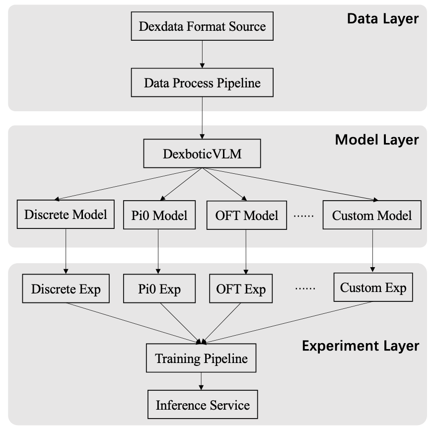

# Overview

Dexbotic is an open-sourced Vision-Language-Action model toolbox based on PyTorch. 

## What it solves?

Recently, significant progress has been made in the field of embodied intelligence with the development of Vision-Language-Action (VLA) models. However, research in this area is fragmented across various institutions, each using different deep learning frameworks and model architectures. This diversity creates challenges for users when comparing policies, as they must configure multiple experimental environments and data formats, making the VLA development process cumbersome. Additionally, ensuring that each policy being compared is optimized to its fullest potential is difficult, leading to unfair comparisons. Furthermore, VLA models have evolved alongside Vision-Language Models (VLMs). However, many existing VLA models are built on outdated VLMs, making most users fail to benefit from the latest advanced VLMs.

Dexbotic aims to provide a one-stop VLA research service for professionals in embodied intelligence field. It offers a codebase that supports multiple mainstream VLA policies simultaneously, allowing users to reproduce various mainstream VLA methods with just a single environment setup based on the pretrained models we provide. Additionally, Dexbotic will continuously update to include more of the latest pre-trained foundation models and cutting-edge VLA models in the industry.

## Target users

Research users in the field of embodied intelligence, including students and faculties from universities, as well as R&D personnel from industry.

## Main feature

### Unified Modular VLA Framework

- Dexbotic centers around VLA models and is compatible with open-source interfaces of mainstream large language models. It integrates embodied manipulation and navigation, supporting multiple leading embodied manipulation and navigation policies, while also incorporating interfaces for future whole-body control.

### Powerful Pre-trained Foundation Models

- For mainstream VLA policies such as Pi0 and CogACT, Dexbotic open-sources several more powerful pre-trained foundation models. These models bring significant performance improvements across various mainstream simulators (like SimplerEnv and CALVIN) as well as real-world robotic tasks.

### Experiment-Centric Development Framework

- The experimental framework of Dexbotic adopts a "layered configuration + factory registration + entry dispatch" approach. Users can easily meet various needs such as modifying configurations, changing models, or adding tasks by simply altering the experimental Exp script. This design aligns with the Open-Closed Principle, allowing for flexibility and extensibility while maintaining stability.

### Cloud and Local Training Capabilities

- Dexbotic fully addresses the training needs of users from different universities and enterprises. It supports large-scale cloud-based training platforms such as Alibaba Cloud and Volcano Engine. Additionally, it accommodates local training with consumer-grade GPUs, like RTX 4090 cards.

### Diverse Robot Support for Training and Deployment

- For various mainstream robots, such as UR5, Franka and ALOHA, Dexbotic offers a unified data format for training. It also provides open-source, general-purpose deployment scripts, allowing users to customize their deployments. In the future, Dexbotic will continue to support additional mainstream robotic platforms.

  

  <b>Figure 1.</b> The overall framework diagram of Dexbotic.

## Basic Components

Dexbotic codebase consists of 3 main parts, data, exp and model.

- data supports the data process of various robotic data and conversion to our Dexdataset format.

- exp provides the default experimental configuration for different VLA policies.

  - base_exp defines the basic experimental configuration for optimizer, model, trainer and etc

  - ABC_exp is the specific experimental configuration of "ABC" policy inherited from base_exp

- model is the most important part and includes the detailed implementation of VLA methods.

  - module includes the implementation of various vision encoders and projectors.

  

  <b>Figure 2.</b> The training pipeline.

  

  <b>Figure 3.</b> The inference service.

