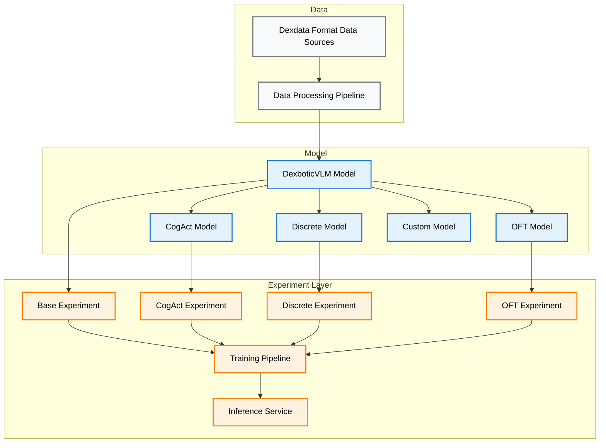
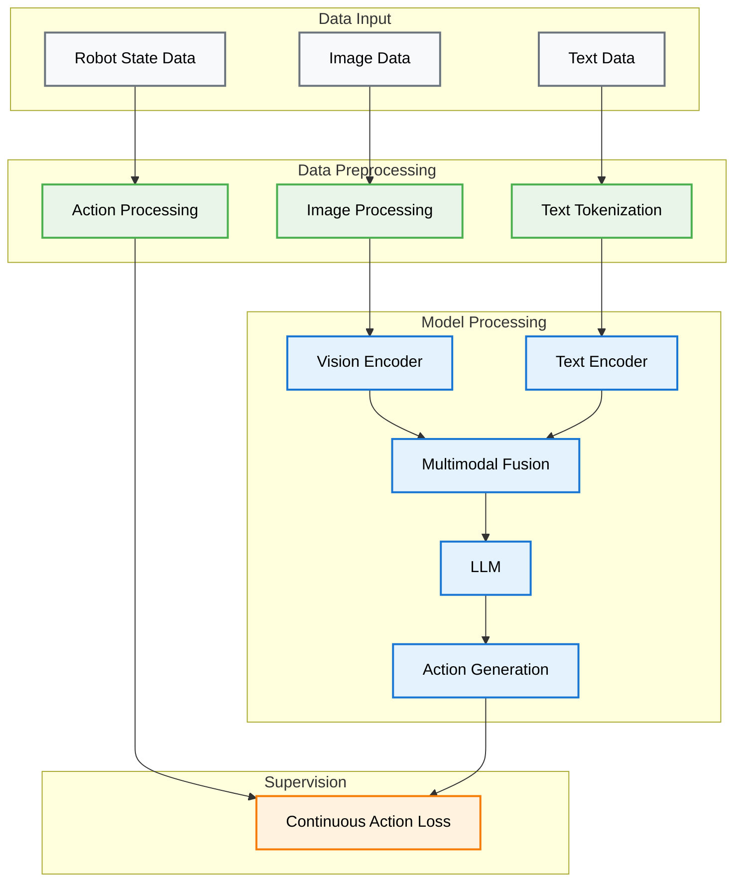
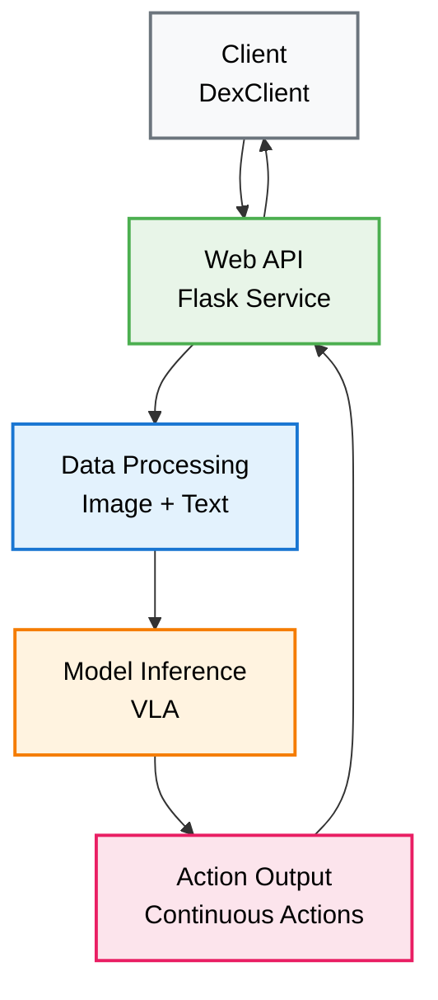

# Dexbotic System Architecture

This document provides a comprehensive overview of the Dexbotic framework architecture, including the overall system design, training pipeline, and inference service. Dexbotic is designed for training and serving vision language action models (VLAs) for robotic control tasks.

## Overall Framework Diagram

Dexbotic implements a modular architecture that separates data handling, model implementation, and experiment management into distinct layers. The framework is organized into three core layers that work together to provide a complete solution for training and serving vision language action models:

- **Data Layer**: Handles data sources in Dexdata format and provides data processing pipelines for multimodal inputs
- **Model Layer**: Contains the base VLM model and specific implementations (CogAct, OFT)
- **Experiment Layer**: Manages training pipelines and inference services for different model types

This design enables flexible model development, easy experimentation, and scalable deployment for robotic applications.

## Training Pipeline

The training pipeline illustrates the complete data flow from input to supervision during model training:

- **Data Input**: Multimodal inputs including images, text instructions, and robot state data
- **Data Preprocessing**: Image processing, text tokenization, and action normalization/transformation
- **Model Processing**: Vision encoding, text encoding, multimodal fusion, LLM processing, and action generation
- **Supervision**: Continuous action loss calculation for training supervision

## Inference Service

The inference service provides a streamlined pipeline for action generation during deployment:

- **Client**: DexClient Python client that sends requests with images and text
- **Web API**: Flask-based service that handles HTTP requests and responses
- **Data Processing**: Processes incoming images and text data for model input
- **Model Inference**: VLA (Vision-Language-Action) model that generates continuous actions
- **Action Output**: Returns continuous action commands to the client

