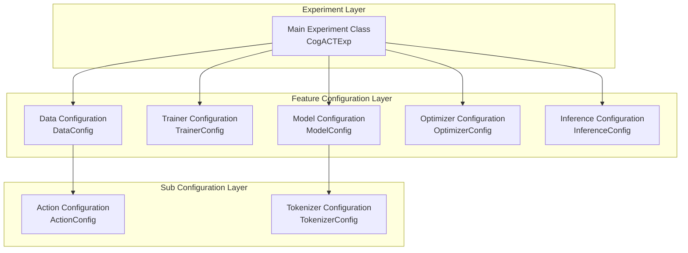

# Dexbotic Experiment Configuration Guide

This document provides detailed instructions on how to configure and run experiments in the Dexbotic framework. 

## Table of Contents

- [Quick Start](#quick-start)
- [Configuration Architecture](#configuration-architecture)
- [Configuration Classes](#configuration-classes)

## Quick Start

This guide uses the CogACT model as an example to demonstrate how to configure and run experiments in the Dexbotic framework.

### 1. Create Experiment File

Create your experiment file in the `playground/` directory, for example `my_experiment.py`:

```python
from dataclasses import dataclass, field
from datetime import datetime
from dexbotic.exp.cogact_exp import (
    CogACTActionConfig as _CogACTActionConfig,
    CogACTDataConfig as _CogACTDataConfig,
    CogACTExp as _CogACTExp,
    CogACTModelConfig as _CogACTModelConfig,
    CogACTTrainerConfig as _CogACTTrainerConfig,
    InferenceConfig as _CogACTInferenceConfig
)

@dataclass
class MyTrainerConfig(_CogACTTrainerConfig):
    """My trainer configuration"""
    output_dir: str = field(default=f'./checkpoints/{datetime.now().strftime("%m%d")}-my_exp')
    wandb_project: str = field(default='my_dexbotic_project')
    num_train_epochs: int = field(default=10)

@dataclass
class MyDataConfig(_CogACTDataConfig):
    """My data configuration"""
    dataset_name: str = field(default='my_dataset')

@dataclass
class MyModelConfig(_CogACTModelConfig):
    """My model configuration"""
    model_name_or_path: str = field(default='/path/to/pretrained/model')

@dataclass
class MyExp(_CogACTExp):
    """My main experiment class"""
    model_config: MyModelConfig = field(default_factory=MyModelConfig)
    trainer_config: MyTrainerConfig = field(default_factory=MyTrainerConfig)
    data_config: MyDataConfig = field(default_factory=MyDataConfig)

if __name__ == "__main__":
    exp = MyExp()
    exp.train()  # or exp.inference()
```

### 2. Training Usage

After creating the experiment file, you can run training in the following ways:

```bash
# Use torchrun for distributed training
torchrun playground/my_experiment.py
```

During training, the system will:
- Load the dataset and perform preprocessing
- Save model checkpoints to `output_dir` according to configuration
- Use Weights & Biases to record training metrics (if `wandb_project` is correctly configured)
- Save models periodically according to `save_steps` setting

### 3. Inference Usage

After training is complete, you can use the trained model for inference:

```bash
# Start inference service
python playground/my_experiment.py --task inference
```

When the inference service starts, it will:
- Load the trained model and tokenizer
- Start a Flask web service listening on the specified port
- Provide `/process_frame` endpoint to receive image and text inputs
- Return predicted action sequences

**Inference API Usage Example:**

```bash
# Use curl to send inference requests
curl -X POST http://localhost:7891/process_frame \
  -F "text=Grab the red object" \
  -F "image=@/path/to/your/image.jpg"

# Response example
# {"response": [0.1, 0.2, 0.3, 0.4, 0.5, 0.6, 1.0]}
```


## Configuration Architecture

Dexbotic uses a layered configuration architecture with the following main configuration classes:



## Configuration Classes

### 1. Model Configuration (ModelConfig)

Controls model architecture and initialization parameters:

```python
@dataclass
class CogACTModelConfig(ModelConfig):
    # Pre-trained model path
    model_name_or_path: str = field(default='/path/to/model')
    
    # Multimodal projector type
    mm_projector_type: str = field(default='mlp2x_gelu')
    
    # Vision encoder path
    mm_vision_tower: str = field(default=OPENAI_CLIP_PATH)
    
    # Chat template type
    chat_template: str = field(default='dexbotic')
    
    # Action model configuration
    action_model_type: str = field(default='DiT-B')
    action_dim: int = field(default=7)
    chunk_size: int = field(default=16)
    
    # Freezing strategies
    freeze_llm: bool = field(default=False)
    freeze_mm_projector: bool = field(default=False)
    freeze_mm_vision: bool = field(default=False)
    freeze_action_head: bool = field(default=False)
```

**Key Parameter Descriptions:**
- `model_name_or_path`: Pre-trained model path, supports local paths or HuggingFace model names
- `action_dim`: Action dimension, typically 7 (3D position + 3D rotation + 1 gripper)
- `chunk_size`: Action sequence chunk size
- `freeze_*`: Controls whether different modules participate in training

### 2. Trainer Configuration (TrainerConfig)

Controls training process parameters:

```python
@dataclass
class CogACTTrainerConfig(TrainerConfig):
    # Output directory
    output_dir: str = field(default='./checkpoints')
    
    # Training parameters
    num_train_epochs: int = field(default=5)
    per_device_train_batch_size: int = field(default=8)
    gradient_accumulation_steps: int = field(default=2)
    
    # Save strategy
    save_strategy: str = field(default='steps')
    save_steps: int = field(default=20000)
    save_total_limit: int = field(default=1)
    
    # Logging and monitoring
    logging_steps: int = field(default=10)
    wandb_project: str = field(default='dexbotic')
    
    # Performance optimization
    gradient_checkpointing: bool = field(default=True)
    bf16: bool = field(default=True)
    tf32: bool = field(default=True)
    
    # DeepSpeed configuration
    deepspeed: str = field(default='./script/deepspeed/zero3.json')
```

**Key Parameter Descriptions:**
- `output_dir`: Model checkpoint save directory
- `per_device_train_batch_size`: Batch size per GPU
- `gradient_accumulation_steps`: Gradient accumulation steps, effective batch size = batch_size × accumulation_steps × num_gpus
- `save_steps`: Save model every N steps
- `wandb_project`: Weights & Biases project name for experiment tracking

### 3. Data Configuration (DataConfig)

Controls dataset and data processing parameters:

```python
@dataclass
class CogACTDataConfig(DataConfig):
    # Dataset name
    dataset_name: str = field(default='example_dataset')
    
    # Image processing
    num_images: int = field(default=1)
    images_keys: list[str] = field(default=None)
    aug_policy: str = field(default='v3')
    image_aspect_ratio: str = field(default='pad')
    
    # Action configuration
    action_config: ActionConfig = field(default_factory=CogACTActionConfig)
    
    # Auto normalization
    auto_norm: bool = field(default=True)
    auto_norm_method: str = field(default='default')
```

**Key Parameter Descriptions:**
- `dataset_name`: Dataset name, must match the dataset in the data loader
- `num_images`: Number of images to process each time
- `aug_policy`: Data augmentation strategy, affects image preprocessing
- `auto_norm`: Whether to automatically compute action normalization parameters
- `auto_norm_method`: Method for computing action normalization statistics. Options:
  - `'default'`: Uses q01-q99 percentile-based normalization (recommended)
  - `'minmax'`: Uses min-max normalization

### 4. Optimizer Configuration (OptimizerConfig)

Controls optimizer parameters:

```python
@dataclass
class CogACTOptimizerConfig(OptimizerConfig):
    # Base learning rate
    base_lr: float = field(default=2e-5)
    
    # Learning rate scheduling
    lr_scheduler_type: str = field(default='cosine')
    warmup_ratio: float = field(default=0.03)
    
    # Weight decay
    weight_decay: float = field(default=0.0)
    
    # Gradient clipping
    max_grad_norm: float = field(default=1.0)
```

### 5. Inference Configuration (InferenceConfig)

Controls inference service parameters:

```python
@dataclass
class InferenceConfig(Config):
    # Model path for inference
    model_name_or_path: str = field(default=None)
    
    # Service configuration
    port: int = field(default=7891)
    
    # Debug options
    save_image: bool = field(default=False)
    save_image_dir: str = field(default='./debug_data')
    
    # Normalization statistics
    norm_stats: dict = field(default=None)
```

**Key Parameter Descriptions:**
- `model_name_or_path`: Path to the trained model for inference.
- `port`: Port number for the inference service to listen on (default: 7891)
- `save_image`: Whether to save input images for debugging purposes
- `save_image_dir`: Directory path to save debug images when `save_image=True`
- `norm_stats`: Action normalization statistics used to denormalize predicted actions. If None, automatically loads from model directory

